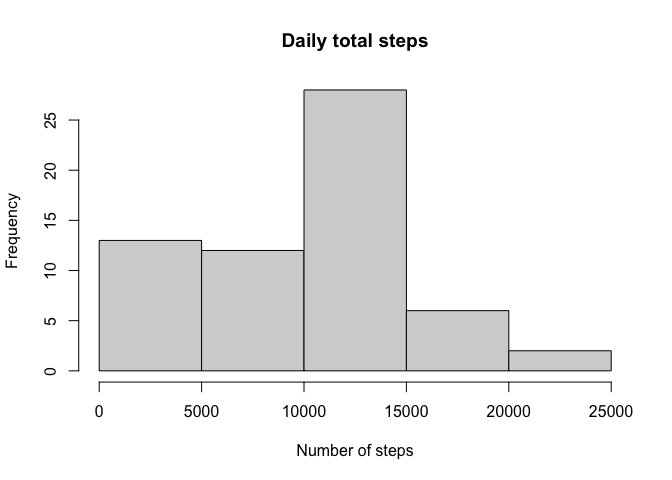
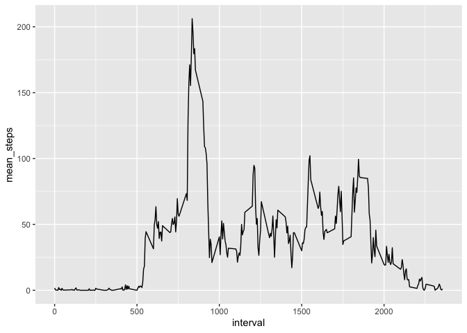
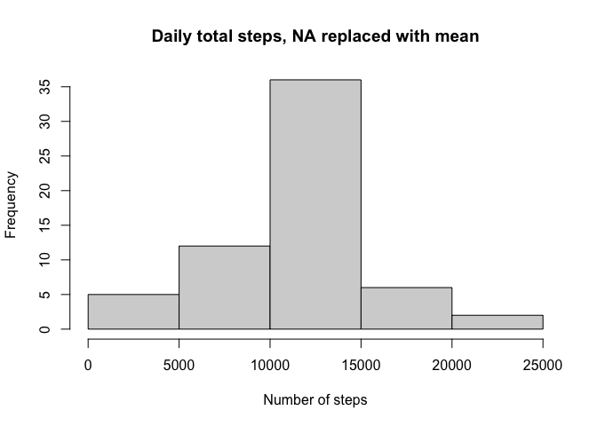
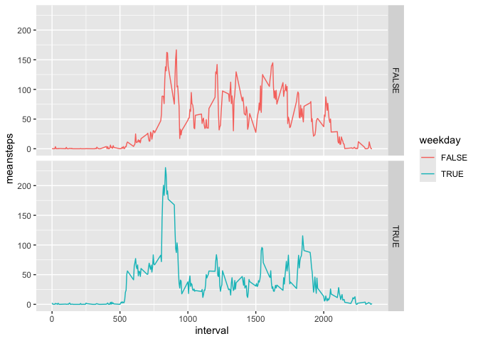

## Loading and preprocessing the data


``` r
        if (file.exists("activity.zip")) { 
                unzip("activity.zip")
                print("Success: Activity.zip has been unzipped into working directory.")
        } else 
                {print("Error: please provide the activity.zip file")}
```

```
## [1] "Success: Activity.zip has been unzipped into working directory."
```

Load the dataset and packages into the R environment

``` r
library(lubridate)
```

```
## 
## Attaching package: 'lubridate'
```

```
## The following objects are masked from 'package:base':
## 
##     date, intersect, setdiff, union
```

``` r
library(ggplot2)
library(dplyr)
```

```
## 
## Attaching package: 'dplyr'
```

```
## The following objects are masked from 'package:stats':
## 
##     filter, lag
```

```
## The following objects are masked from 'package:base':
## 
##     intersect, setdiff, setequal, union
```

``` r
activitydata <- read.csv("activity.csv")
activitydata$date <- as.Date(activitydata$date, "%Y-%m-%d")
activitydata$period <- as.period(activitydata$interval, unit = "minute")
```


## What is mean total number of steps taken per day?
For this part of the assignment we will ignore the missing values in the data set.  

``` r
hist(rowsum(activitydata$steps, activitydata$date, na.rm = T), main = 'Daily total steps', xlab = 'Number of steps')
```

<!-- -->

``` r
paste("Mean steps per day:", with(na.omit(activitydata), mean(rowsum(steps, date))),".")
```

```
## [1] "Mean steps per day: 10766.1886792453 ."
```

``` r
paste("Median steps per day:", with(na.omit(activitydata), median(rowsum(steps, date))),".")
```

```
## [1] "Median steps per day: 10765 ."
```


## What is the average daily activity pattern?
Make a time series plot of the 5-minute interval (x-axis) and the average number of steps taken, averaged across all days (y-axis).

``` r
interval_meansteps <- with(na.omit(activitydata), aggregate(steps, list(interval), mean))
names(interval_meansteps) <- c('interval', 'mean_steps')

p <- ggplot(interval_meansteps, aes(x= interval, y = mean_steps)) + geom_line()
p
```

<!-- -->
Which 5-minute interval, on average across all the days in the dataset, contains the maximum number of steps?

``` r
interval_meansteps[which.max(interval_meansteps$mean_steps),]
```

```
##     interval mean_steps
## 104      835   206.1698
```


## Imputing missing values
Calculate the number of missing values in the data set

``` r
StepsNa <- sum(is.na(activitydata$steps))
DateNa <- sum(is.na(activitydata$date))
PeriodNa <- sum(is.na(activitydata$period))

paste("In the activity.csv dataset, data is missing for", " ", StepsNa, " ", "steps entries,", DateNa, "", "dates entries, and", "", PeriodNa, " ", "period entries.")
```

```
## [1] "In the activity.csv dataset, data is missing for   2304   steps entries, 0  dates entries, and  0   period entries."
```

Imputs the *interval means steps* when steps in NA, else uses the actual counted steps value.

``` r
activitydata2 <- activitydata
activitydata2 <- left_join(activitydata2, interval_meansteps, by = "interval")
activitydata2 <- mutate(activitydata2, steps = ifelse(is.na(steps),mean_steps, steps))
```


``` r
StepsNa2 <- sum(is.na(activitydata2$steps))
DateNa2 <- sum(is.na(activitydata2$date))
PeriodNa2 <- sum(is.na(activitydata2$period))

paste("In the activity.csv dataset, data is missing for", " ", StepsNa2, " ", "steps entries,", DateNa2, "", "dates entries, and", "", PeriodNa2, " ", "period entries.")
```

```
## [1] "In the activity.csv dataset, data is missing for   0   steps entries, 0  dates entries, and  0   period entries."
```


Make a histogram of the total number of steps taken each day and Calculate and report the mean and median total number of steps taken per day.  


``` r
hist(rowsum(activitydata2$steps, activitydata2$date), main = 'Daily total steps, NA replaced with mean', xlab = 'Number of steps')
```

<!-- -->

Do these values differ from the estimates from the first part of the assignment? What is the impact of imputing missing data on the estimates of the total daily number of steps?

``` r
with(activitydata, summary(rowsum(steps, date)))
```

```
##        V1       
##  Min.   :   41  
##  1st Qu.: 8841  
##  Median :10765  
##  Mean   :10766  
##  3rd Qu.:13294  
##  Max.   :21194  
##  NA's   :8
```

``` r
with(activitydata2, summary(rowsum(steps, date)))
```

```
##        V1       
##  Min.   :   41  
##  1st Qu.: 9819  
##  Median :10766  
##  Mean   :10766  
##  3rd Qu.:12811  
##  Max.   :21194
```

``` r
print("Yes, the values are changed and the histogram becomes more heavy towards the middle after the missing values have been replaced with their interval means.")
```

```
## [1] "Yes, the values are changed and the histogram becomes more heavy towards the middle after the missing values have been replaced with their interval means."
```


## Are there differences in activity patterns between weekdays and weekends?
Create a new factor variable in the dataset with two levels – “weekday” and “weekend” indicating whether a given date is a weekday or weekend day.

``` r
weekdaysvector <- weekdays(activitydata2$date)
is_weekday <- weekdaysvector %in% c("Monday", "Tuesday", "Wednesday", "Thursday", "Friday")
activitydata2$weekday <- is_weekday
```
Make a panel plot containing a time series plot of the 5-minute interval (x-axis) and the average number of steps taken, averaged across all weekday days or weekend days (y-axis). 


``` r
interval_weekday_mean <- with(activitydata2, aggregate(steps, list(interval,weekday), mean))
names(interval_weekday_mean) <- c("interval","weekday","meansteps")

p <- ggplot(interval_weekday_mean, aes(x = interval, y = meansteps, color = weekday))
p + facet_grid(weekday ~ .) + geom_line()
```

<!-- -->
